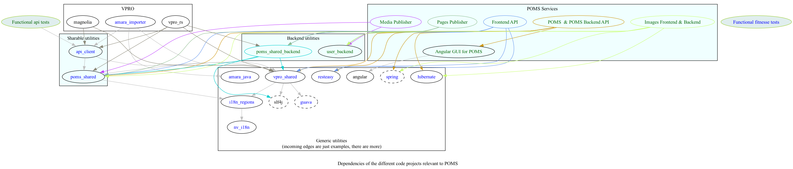
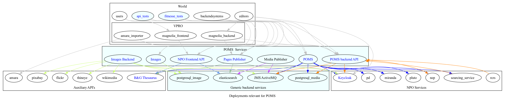

The POMS ecosystem
==================

This is the poms parent. This is the parent pom of the several projects in the poms ecosystem.

Functional Tests
----------------
See npo-functional-tests/trunk/src/test/resources/npo-functional-tests.properties

GUI and Backend RestServices
--------
poms[|-dev|-test].omroep.nl/api[|-dev|-test].poms.omroep.nl
developer's port: 8071, backend rest service on /rs

Frontend API
-------------
rs[|-dev|-test].poms.omroep.nl
developer's port: 8070

Page publisher API
-------------------
publish[|-dev|-test]..pages.omroep.nl
developer's port: 8069

Publisher API
-------------
developer's port: not relevant (no frontend)

NPO API Clients
---------------
This project provides java clients for the above projects. 

VPRO shared
-----------
Most projects also depend on a collection of utilities maintained by VPRO but which are not specific for POMS or its subsystems

POMS shared
-----------
These modules are specific for POMS, and most noticably contain the domain classes shared by most projects, like the 'domain' objects and services.

Classes from this may also end up outside the POMS projects themselves. Like e.g. CMS's (probably via the api clients)

POMS shared backend
-------------------
Sometimes different POMS project share 'backend' code, like repository implementations. These need never be exposed to the outside world.

Dependencies
------------
<!--- PNG's are created using 'graphviz' from the *.dot files. See Makefile.-->
This describes schematicly the dependencies between the several modules relevant to poms.

This does not intend to be exhaustive, but merely tries to sketch the big picture.

An important aspect is that dependencies may only be one way. Often dependencies are both transitive and direct, of which only examples are indicated.

Deployments
------------
This describes schematicly the connections between actual systems relevant to poms.

This does not intend to be exhaustive, but merely tries to sketch the big picture.

